# 🏭 WarehouseManagamentSystem — System Class Diagram

> Full class diagram for the WarehouseHub platform covering all roles, entities, relationships, and enumerations.

---

## 📐 Class Diagram

```mermaid
classDiagram

    %% ─────────────────────────────────────────
    %% AUTH
    %% ─────────────────────────────────────────

    class User {
        -UUID id
        -string firstName
        -string lastName
        -string email
        -string passwordHash
        -string phone
        -UserRole role
        -boolean isVerified
        -DateTime createdAt
        -DateTime updatedAt
        +register() User
        +login() AuthToken
        +updateProfile() User
        +changePassword() void
    }

    class AuthToken {
        -UUID userId
        -string accessToken
        -string refreshToken
        -DateTime expiresAt
        +validate() boolean
        +refresh() AuthToken
        +revoke() void
    }

    %% ─────────────────────────────────────────
    %% WAREHOUSE
    %% ─────────────────────────────────────────

    class Warehouse {
        -UUID id
        -UUID ownerId
        -string name
        -string description
        -number totalAreaM2
        -WarehouseStatus status
        -boolean isPublished
        -string[] imageUrls
        -DateTime createdAt
        +publish() void
        +unpublish() void
        +getAvailableRooms() Room[]
        +getOccupancyRate() number
        +calculateRevenue() number
    }

    class Address {
        -string street
        -string city
        -string country
        -string postalCode
        -number latitude
        -number longitude
        +toGeoPoint() GeoPoint
    }

    class Zone {
        -UUID id
        -UUID warehouseId
        -string name
        -GoodCategory goodCategory
        -number temperatureMin
        -number temperatureMax
        -boolean humidityControl
        +getRooms() Room[]
        +getAvailableCapacity() number
    }

    class Room {
        -UUID id
        -UUID zoneId
        -string roomNumber
        -number areaM2
        -number pricePerM2
        -RoomStatus status
        -UUID currentRentalId
        +isAvailable() boolean
        +getTotalPrice() number
        +reserve() void
        +release() void
    }

    %% ─────────────────────────────────────────
    %% RENTAL
    %% ─────────────────────────────────────────

    class Rental {
        -UUID id
        -UUID customerId
        -UUID roomId
        -DateTime startDate
        -DateTime endDate
        -number totalCost
        -RentalStatus status
        -UUID paymentId
        +activate() void
        +terminate() void
        +extend(endDate) Rental
        +calculateCost() number
    }

    %% ─────────────────────────────────────────
    %% INVENTORY
    %% ─────────────────────────────────────────

    class GoodItem {
        -UUID id
        -UUID rentalId
        -UUID roomId
        -string name
        -GoodCategory category
        -number quantity
        -MeasureUnit unit
        -DateTime expiryDate
        -string batchCode
        -DateTime addedAt
        +updateQuantity(amount) void
        +isExpiringSoon() boolean
        +getStockReport() StockReport
    }

    class InventoryLog {
        -UUID id
        -UUID goodItemId
        -LogAction actionType
        -number quantityChange
        -UUID performedBy
        -string note
        -DateTime timestamp
        +getHistory(itemId) InventoryLog[]
    }

    %% ─────────────────────────────────────────
    %% ORDER
    %% ─────────────────────────────────────────

    class Order {
        -UUID id
        -UUID customerId
        -UUID rentalId
        -UUID staffId
        -OrderStatus status
        -Priority priority
        -string notes
        -DateTime createdAt
        -DateTime processedAt
        +assignStaff(staffId) void
        +markPackaged() void
        +cancel() void
        +getOrderItems() OrderItem[]
    }

    class OrderItem {
        -UUID id
        -UUID orderId
        -UUID goodItemId
        -number requestedQty
        -number packedQty
        -MeasureUnit unit
        +confirmPacking(qty) void
    }

    %% ─────────────────────────────────────────
    %% DELIVERY
    %% ─────────────────────────────────────────

    class Delivery {
        -UUID id
        -UUID orderId
        -UUID agentId
        -UUID destinationId
        -DeliveryStatus status
        -DateTime scheduledAt
        -DateTime pickedUpAt
        -DateTime deliveredAt
        -string proofImageUrl
        -string agentNotes
        +assignAgent(agentId) void
        +accept() void
        +markPickedUp() void
        +complete(proofUrl) void
        +fail(reason) void
    }

    class Destination {
        -UUID id
        -UUID customerId
        -string name
        -DestinationType type
        -string contactPerson
        -string contactPhone
        +getDeliveryHistory() Delivery[]
    }

    %% ─────────────────────────────────────────
    %% NOTIFICATION
    %% ─────────────────────────────────────────

    class Notification {
        -UUID id
        -UUID userId
        -NotificationType type
        -string title
        -string message
        -boolean isRead
        -UUID refId
        -string refType
        -DateTime createdAt
        +markRead() void
        +send() void
    }

    %% ─────────────────────────────────────────
    %% PAYMENT
    %% ─────────────────────────────────────────

    class Payment {
        -UUID id
        -UUID rentalId
        -UUID customerId
        -number amount
        -string currency
        -PaymentMethod method
        -PaymentStatus status
        -string transactionId
        -DateTime paidAt
        +process() PaymentResult
        +refund() void
        +getReceipt() Receipt
    }

    %% ─────────────────────────────────────────
    %% REVIEW
    %% ─────────────────────────────────────────

    class Review {
        -UUID id
        -UUID warehouseId
        -UUID customerId
        -number rating
        -string comment
        -DateTime createdAt
        +submit() Review
        +getAverageRating(warehouseId) number
    }

    %% ─────────────────────────────────────────
    %% ENUMERATIONS
    %% ─────────────────────────────────────────

    class UserRole {
        <<enumeration>>
        WAREHOUSE_OWNER
        CUSTOMER
        STAFF_WORKER
        DELIVERY_AGENT
        ADMIN
    }

    class WarehouseStatus {
        <<enumeration>>
        DRAFT
        PUBLISHED
        SUSPENDED
        CLOSED
    }

    class RoomStatus {
        <<enumeration>>
        AVAILABLE
        RESERVED
        OCCUPIED
        MAINTENANCE
    }

    class RentalStatus {
        <<enumeration>>
        PENDING
        ACTIVE
        EXPIRED
        TERMINATED
    }

    class GoodCategory {
        <<enumeration>>
        FOOD
        MEDICINE
        COLD_STORAGE
        ELECTRONICS
        CHEMICALS
        GENERAL
    }

    class MeasureUnit {
        <<enumeration>>
        KG
        G
        LITRE
        PIECE
        BOX
        PALLET
    }

    class OrderStatus {
        <<enumeration>>
        PLACED
        ACCEPTED
        PACKAGING
        PACKAGED
        DISPATCHED
        CANCELLED
    }

    class DeliveryStatus {
        <<enumeration>>
        PENDING
        ACCEPTED
        PICKED_UP
        IN_TRANSIT
        DELIVERED
        FAILED
    }

    class NotificationType {
        <<enumeration>>
        ORDER_PLACED
        PACKAGE_READY
        DELIVERY_ASSIGNED
        DELIVERY_DONE
        SYSTEM
    }

    class DestinationType {
        <<enumeration>>
        MARKET
        SUPERMARKET
        RESTAURANT
        PHARMACY
        WAREHOUSE
        OTHER
    }

    class PaymentMethod {
        <<enumeration>>
        CREDIT_CARD
        DEBIT_CARD
        BANK_TRANSFER
        CASH
        DIGITAL_WALLET
    }

    class PaymentStatus {
        <<enumeration>>
        PENDING
        COMPLETED
        FAILED
        REFUNDED
    }

    %% ─────────────────────────────────────────
    %% RELATIONSHIPS
    %% ─────────────────────────────────────────

    %% Auth
    User "1" --> "1" AuthToken : generates
    User "1" --> "0..*" Warehouse : owns

    %% Warehouse structure
    Warehouse "1" *-- "1" Address : located at
    Warehouse "1" *-- "1..*" Zone : divided into
    Zone "1" *-- "1..*" Room : contains

    %% Rental
    User "1" --> "0..*" Rental : creates
    Rental "1" --> "1" Room : rents
    Rental "1" *-- "0..*" GoodItem : stores
    GoodItem "1" --> "0..*" InventoryLog : tracked by

    %% Order
    Rental "1" --> "0..*" Order : generates
    Order "1" *-- "1..*" OrderItem : contains
    OrderItem "1" --> "1" GoodItem : references
    User "1" --> "0..*" Order : processes

    %% Delivery
    Order "1" --> "1" Delivery : fulfilled by
    Delivery "1" --> "1" Destination : delivers to
    Destination "1" *-- "1" Address : located at
    User "1" --> "0..*" Delivery : handles

    %% Support
    User "1" --> "0..*" Notification : receives
    Rental "1" --> "0..*" Payment : paid via
    Warehouse "1" --> "0..*" Review : reviewed in
    User "1" --> "0..*" Review : writes

    %% Enum usage
    User --> UserRole : has
    Warehouse --> WarehouseStatus : has
    Room --> RoomStatus : has
    Rental --> RentalStatus : has
    GoodItem --> GoodCategory : categorized as
    GoodItem --> MeasureUnit : measured in
    Order --> OrderStatus : has
    Delivery --> DeliveryStatus : has
    Notification --> NotificationType : typed as
    Destination --> DestinationType : typed as
    Payment --> PaymentMethod : paid via
    Payment --> PaymentStatus : has
    Zone --> GoodCategory : specializes in
```



---

## 🗂️ Entity Summary

| Class | Layer | Description |
|---|---|---|
| `User` | Auth | Platform user with role-based access |
| `AuthToken` | Auth | JWT access & refresh token pair |
| `Warehouse` | Warehouse | Physical warehouse published by owner |
| `Address` | Warehouse | Location info (used by Warehouse & Destination) |
| `Zone` | Warehouse | Named section of a warehouse by good category |
| `Room` | Warehouse | Rentable unit within a zone with m² pricing |
| `Rental` | Rental | Agreement between customer and a room |
| `GoodItem` | Inventory | A tracked good stored in a rented room |
| `InventoryLog` | Inventory | Full audit trail of every stock change |
| `Order` | Order | Dispatch request created by customer, handled by staff |
| `OrderItem` | Order | Individual good line item within an order |
| `Delivery` | Delivery | Delivery task accepted and completed by an agent |
| `Destination` | Delivery | Target location (market, supermarket, etc.) |
| `Notification` | Notification | Real-time alert sent to any user role |
| `Payment` | Payment | Billing record for a rental |
| `Review` | Review | Customer rating and feedback for a warehouse |

---

## 🔢 Enum Summary

| Enum | Used By |
|---|---|
| `UserRole` | `User` — WAREHOUSE_OWNER, CUSTOMER, STAFF_WORKER, DELIVERY_AGENT, ADMIN |
| `WarehouseStatus` | `Warehouse` — DRAFT, PUBLISHED, SUSPENDED, CLOSED |
| `RoomStatus` | `Room` — AVAILABLE, RESERVED, OCCUPIED, MAINTENANCE |
| `RentalStatus` | `Rental` — PENDING, ACTIVE, EXPIRED, TERMINATED |
| `GoodCategory` | `Zone`, `GoodItem` — FOOD, MEDICINE, COLD_STORAGE, ELECTRONICS, CHEMICALS, GENERAL |
| `MeasureUnit` | `GoodItem`, `OrderItem` — KG, G, LITRE, PIECE, BOX, PALLET |
| `OrderStatus` | `Order` — PLACED, ACCEPTED, PACKAGING, PACKAGED, DISPATCHED, CANCELLED |
| `DeliveryStatus` | `Delivery` — PENDING, ACCEPTED, PICKED_UP, IN_TRANSIT, DELIVERED, FAILED |
| `NotificationType` | `Notification` — ORDER_PLACED, PACKAGE_READY, DELIVERY_ASSIGNED, DELIVERY_DONE, SYSTEM |
| `DestinationType` | `Destination` — MARKET, SUPERMARKET, RESTAURANT, PHARMACY, WAREHOUSE, OTHER |
| `PaymentMethod` | `Payment` — CREDIT_CARD, DEBIT_CARD, BANK_TRANSFER, CASH, DIGITAL_WALLET |
| `PaymentStatus` | `Payment` — PENDING, COMPLETED, FAILED, REFUNDED |

---

## 🔄 Key Relationship Flows

```
WAREHOUSE OWNER
└── Creates Warehouse
    └── Defines Zones (by GoodCategory)
        └── Adds Rooms (area m², price/m²)

CUSTOMER
└── Rents a Room → Rental
    └── Stores GoodItems → InventoryLog (audit trail)
    └── Places Order
        └── Specifies OrderItems (which goods, how much)

STAFF WORKER
└── Accepts Order
    └── Packages OrderItems → marks Order as PACKAGED
    └── Triggers Notification → Delivery Agent

DELIVERY AGENT
└── Accepts Delivery
    └── Picks up packaged goods
    └── Delivers to Destination (market, supermarket…)
    └── Uploads proof → marks Delivery DELIVERED
        └── GoodItem quantities auto-updated ✅
```

---

## 🔗 Relationship Types

| Symbol | Type | Meaning |
|---|---|---|
| `*--` | Composition | Child cannot exist without parent |
| `-->` | Association | Reference / uses relationship |
| `"1" .. "0..*"` | Multiplicity | One-to-many |
| `"1" .. "1"` | Multiplicity | One-to-one |

---

> 💡 **Tip:** GitHub renders Mermaid diagrams natively in `.md` files — no plugins needed. Just push this file and the diagram will display automatically.
