# Class Diagram — Entity Model

> Mermaid `classDiagram` showing all JPA entities grouped by the 5 microservices.
> Each entity maps 1-to-1 to a database table defined in [`docs/database-schema.sql`](docs/database-schema.sql).
> Cross-service references use UUID fields with no FK constraint (annotated with `cross-ref`).

---

## Full Diagram

```mermaid
classDiagram
    direction TB

    %% ============================================================
    %% IDENTITY SERVICE — identity_db (5 entities)
    %% ============================================================
    namespace IdentityService {
        class User {
            UUID id PK
            String email UNIQUE
            String password
            String firstName
            String lastName
            String phone
            UserRole role
            UserStatus status
            Instant createdAt
            Instant updatedAt
        }

        class WarehouseOwnerProfile {
            UUID id PK
            UUID userId FK → User UNIQUE
            String companyName
            String taxId UNIQUE
            String address
            String city
            String country
            UUID approvedBy FK → User
            Instant approvedAt
            String rejectionReason
            Instant createdAt
            Instant updatedAt
            Instant deletedAt
        }

        class CustomerProfile {
            UUID id PK
            UUID userId FK → User UNIQUE
            String companyName
            String taxId UNIQUE
            String address
            String city
            String country
            String contactPersonName
            Instant createdAt
            Instant updatedAt
        }

        class StaffProfile {
            UUID id PK
            UUID userId FK → User UNIQUE
            UUID warehouseId cross-ref
            String position
            Instant createdAt
            Instant updatedAt
        }

        class DeliveryAgentProfile {
            UUID id PK
            UUID userId FK → User UNIQUE
            UUID warehouseId cross-ref
            String vehicleInfo
            Instant createdAt
            Instant updatedAt
        }
    }

    User "1" --> "0..1" WarehouseOwnerProfile : has
    User "1" --> "0..1" CustomerProfile : has
    User "1" --> "0..1" StaffProfile : has
    User "1" --> "0..1" DeliveryAgentProfile : has
    User "1" --> "0..*" WarehouseOwnerProfile : approvedBy

    %% ============================================================
    %% INVENTORY SERVICE — inventory_db (13 entities)
    %% Warehouse + Goods merged — same DB, real FKs
    %% ============================================================
    namespace InventoryService {
        class Warehouse {
            UUID id PK
            UUID ownerId cross-ref
            String name
            String description
            String address
            String city
            String country
            BigDecimal latitude
            BigDecimal longitude
            BigDecimal totalSurfaceArea
            WarehouseStatus status
            Instant createdAt
            Instant updatedAt
        }

        class WarehouseImage {
            UUID id PK
            UUID warehouseId FK → Warehouse
            String url
            Boolean isPrimary
            Instant createdAt
        }

        class WarehouseExcelImport {
            UUID id PK
            UUID warehouseId FK → Warehouse
            UUID ownerId cross-ref
            String fileName
            ImportStatus status
            int totalRows
            int successRows
            int failedRows
            String errorFileUrl
            Instant createdAt
        }

        class Category {
            UUID id PK
            String name UNIQUE
            String description
            Instant createdAt
        }

        class Zone {
            UUID id PK
            UUID warehouseId FK → Warehouse
            String name
            String description
            TemperatureType temperatureType
            BigDecimal totalSurfaceArea
            ZoneStatus status
            Instant createdAt
            Instant updatedAt
        }

        class ZoneCategory {
            UUID id PK
            UUID zoneId FK → Zone
            UUID categoryId FK → Category
            Instant createdAt
        }

        class ZoneAvailability {
            UUID id PK
            UUID zoneId FK → Zone
            LocalDate startDate
            LocalDate endDate
            Instant createdAt
        }

        class Room {
            UUID id PK
            UUID zoneId FK → Zone
            String name
            String description
            BigDecimal totalSurfaceArea
            BigDecimal pricePerSqmDaily
            BigDecimal pricePerSqmWeekly
            BigDecimal pricePerSqmMonthly
            RoomStatus status
            Instant createdAt
            Instant updatedAt
            Instant deletedAt
        }

        class RoomCategory {
            UUID id PK
            UUID roomId FK → Room
            UUID categoryId FK → Category
            Instant createdAt
        }

        class GoodsExcelImport {
            UUID id PK
            UUID bookingId cross-ref
            UUID customerId cross-ref
            String fileName
            GoodsImportStatus status
            int totalRows
            int successRows
            int failedRows
            String errorFileUrl
            Instant arrivalDeadline
            UUID approvedBy cross-ref
            Instant approvedAt
            Instant createdAt
        }

        class GoodsItem {
            UUID id PK
            UUID goodsImportId FK → GoodsExcelImport
            String name
            String sku
            String barcode
            BigDecimal quantity
            GoodsItemStatus status
            Instant createdAt
            Instant updatedAt
            Instant deletedAt
        }

        class GoodsReceipt {
            UUID id PK
            UUID bookingId cross-ref
            UUID receivedBy cross-ref
            String inboundCarrier
            Instant receivedAt
            String notes
        }

        class GoodsReceiptItem {
            UUID id PK
            UUID goodsReceiptId FK → GoodsReceipt
            UUID goodsItemId FK → GoodsItem
            BigDecimal expectedQty
            BigDecimal receivedQty
            ReceiptCondition condition
            String notes
        }
    }

    Warehouse "1" --> "0..*" WarehouseImage : images
    Warehouse "1" --> "0..*" WarehouseExcelImport : imports
    Warehouse "1" --> "0..*" Zone : zones
    Zone "1" --> "0..*" ZoneCategory : categories
    Zone "1" --> "0..*" ZoneAvailability : availabilities
    Zone "1" --> "0..*" Room : rooms
    Room "1" --> "0..*" RoomCategory : categories
    Category "1" --> "0..*" ZoneCategory : zones
    Category "1" --> "0..*" RoomCategory : rooms
    GoodsExcelImport "1" --> "0..*" GoodsItem : items
    GoodsReceipt "1" --> "0..*" GoodsReceiptItem : items
    GoodsItem "1" --> "0..*" GoodsReceiptItem : receipts

    %% ============================================================
    %% RESERVATION SERVICE — reservation_db (6 entities)
    %% Booking + Billing merged — same DB, real FK invoices → bookings
    %% ============================================================
    namespace ReservationService {
        class Booking {
            UUID id PK
            UUID customerId cross-ref
            UUID warehouseId cross-ref
            BookingType bookingType
            UUID roomId cross-ref
            UUID zoneId cross-ref
            LocalDate startDate
            LocalDate endDate
            BigDecimal surfaceArea
            BigDecimal totalPrice
            BookingStatus status
            Instant createdAt
            Instant updatedAt
            Instant deletedAt
        }

        class BookingExpiryNotification {
            UUID id PK
            UUID bookingId FK → Booking UNIQUE
            Instant notifiedAt
            NotificationStatus status
            Instant createdAt
        }

        class Invoice {
            UUID id PK
            UUID customerId cross-ref
            UUID warehouseId cross-ref
            UUID bookingId FK → Booking
            UUID deliveryRequestId cross-ref
            InvoiceType invoiceType
            BigDecimal amount
            String currency
            InvoiceStatus status
            LocalDate dueDate
            Instant createdAt
            Instant updatedAt
        }

        class InvoiceItem {
            UUID id PK
            UUID invoiceId FK → Invoice
            String description
            BigDecimal quantity
            BigDecimal unitPrice
            BigDecimal total
            Instant createdAt
        }

        class Payment {
            UUID id PK
            UUID invoiceId FK → Invoice
            String stripePaymentId UNIQUE
            String stripeReceiptUrl
            BigDecimal amount
            PaymentStatus status
            String failureReason
            Instant paidAt
            Instant createdAt
        }

        class CreditNote {
            UUID id PK
            UUID invoiceId FK → Invoice
            String reason
            BigDecimal amount
            Instant createdAt
        }
    }

    Booking "1" --> "0..1" BookingExpiryNotification : expiry
    Booking "1" --> "0..*" Invoice : invoices
    Invoice "1" --> "0..*" InvoiceItem : items
    Invoice "1" --> "0..*" Payment : payments
    Invoice "1" --> "0..*" CreditNote : creditNotes

    %% ============================================================
    %% DELIVERY SERVICE — delivery_db (5 entities)
    %% ============================================================
    namespace DeliveryService {
        class DeliveryRequest {
            UUID id PK
            UUID bookingId cross-ref
            UUID customerId cross-ref
            String destinationAddress
            String destinationCity
            String destinationCountry
            LocalDate requestedDate
            DeliveryStatus status
            Instant createdAt
            Instant updatedAt
        }

        class DeliveryRequestItem {
            UUID id PK
            UUID deliveryRequestId FK → DeliveryRequest
            UUID goodsItemId cross-ref
            BigDecimal requestedQty
            BigDecimal pickedQty
            UUID pickedBy cross-ref
            Instant pickedAt
        }

        class DeliveryNotification {
            UUID id PK
            UUID deliveryRequestId FK → DeliveryRequest
            UUID notifiedBy cross-ref
            Instant notifiedAt
            DeliveryNotificationStatus status
            Instant expiresAt
        }

        class Shipment {
            UUID id PK
            UUID deliveryRequestId FK → DeliveryRequest
            UUID claimedBy cross-ref
            Instant claimedAt
            Instant scheduledPickupTime
            String trackingNumber UNIQUE
            LocalDate estimatedDeliveryDate
            LocalDate actualDeliveryDate
            ShipmentStatus status
            String notes
            Instant createdAt
            Instant updatedAt
        }

        class ShipmentCheckpoint {
            UUID id PK
            UUID shipmentId FK → Shipment
            ShipmentStatus status
            String location
            String note
            Instant recordedAt
        }
    }

    DeliveryRequest "1" --> "0..*" DeliveryRequestItem : items
    DeliveryRequest "1" --> "0..*" DeliveryNotification : notifications
    DeliveryRequest "1" --> "0..*" Shipment : shipments
    Shipment "1" --> "0..*" ShipmentCheckpoint : checkpoints

    %% ============================================================
    %% PLATFORM SERVICE — platform_db (2 entities)
    %% ============================================================
    namespace PlatformService {
        class Notification {
            UUID id PK
            UUID userId cross-ref
            NotificationType type
            String message
            Boolean isRead
            Instant readAt
            String link
            Instant createdAt
        }

        class AuditLog {
            UUID id PK
            UUID performedBy
            String action
            String entityType
            UUID entityId
            JSONB oldValue
            JSONB newValue
            Instant createdAt
        }
    }

    %% ============================================================
    %% SHARED — outbox_events (one per service DB)
    %% ============================================================
    namespace Shared {
        class OutboxEvent {
            UUID id PK
            String aggregateType
            UUID aggregateId
            String eventType
            JSONB payload
            OutboxStatus status
            Instant createdAt
            Instant publishedAt
        }
    }
```

---

## Enumerations

| Enum | Values |
|---|---|
| `UserRole` | `SUPER_ADMIN`, `WAREHOUSE_OWNER`, `STAFF`, `DELIVERY_AGENT`, `CUSTOMER` |
| `UserStatus` | `ACTIVE`, `SUSPENDED`, `PENDING` |
| `WarehouseStatus` | `DRAFT`, `PUBLISHED`, `SUSPENDED`, `INACTIVE` |
| `ImportStatus` | `PENDING`, `PROCESSING`, `COMPLETED`, `FAILED` |
| `TemperatureType` | `AMBIENT`, `REFRIGERATED`, `FROZEN` |
| `ZoneStatus` | `ACTIVE`, `MAINTENANCE`, `INACTIVE` |
| `RoomStatus` | `AVAILABLE`, `BOOKED`, `MAINTENANCE` |
| `GoodsImportStatus` | `PENDING`, `APPROVED`, `REJECTED` |
| `GoodsItemStatus` | `PENDING`, `IN_WAREHOUSE`, `DELIVERED`, `DAMAGED` |
| `ReceiptCondition` | `GOOD`, `DAMAGED`, `REJECTED` |
| `BookingType` | `ROOM`, `ZONE`, `WAREHOUSE` |
| `BookingStatus` | `PENDING`, `CONFIRMED`, `ACTIVE`, `EXPIRED`, `CANCELLED` |
| `NotificationStatus` | `SENT`, `ACKNOWLEDGED` |
| `InvoiceType` | `BOOKING`, `DELIVERY` |
| `InvoiceStatus` | `DRAFT`, `SENT`, `PAID`, `OVERDUE`, `CANCELLED` |
| `PaymentStatus` | `PENDING`, `SUCCESS`, `FAILED` |
| `DeliveryStatus` | `PENDING`, `CONFIRMED`, `PICKING`, `DISPATCHED`, `DELIVERED`, `CANCELLED` |
| `DeliveryNotificationStatus` | `OPEN`, `CLAIMED`, `EXPIRED` |
| `ShipmentStatus` | `PENDING`, `PICKED_UP`, `IN_TRANSIT`, `DELIVERED` |
| `NotificationType` | `WAREHOUSE_APPROVED`, `WAREHOUSE_REJECTED`, `BOOKING_CONFIRMED`, `BOOKING_CANCELLED`, `BOOKING_EXPIRY`, `GOODS_APPROVED`, `GOODS_REJECTED`, `GOODS_DISCREPANCY`, `DELIVERY_AVAILABLE`, `DELIVERY_CLAIMED`, `DELIVERY_PICKUP_REMINDER`, `DELIVERY_UPDATE`, `INVOICE_GENERATED`, `PAYMENT_SUCCESS`, `PAYMENT_FAILED` |
| `OutboxStatus` | `PENDING`, `SENT`, `FAILED` |

---

## Table Count Summary

| Service | Database | Entities | + Outbox |
|---|---|---|---|
| Identity | identity_db | 5 | + 1 |
| Inventory | inventory_db | 13 | + 1 |
| Reservation | reservation_db | 6 | + 1 |
| Delivery | delivery_db | 5 | + 1 |
| Platform | platform_db | 2 | + 1 |
| **Total** | **5 databases** | **31** | **+ 5 = 36 tables** |
